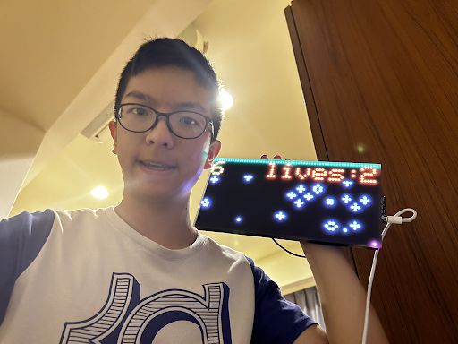

# Crossy Road Like Game Interwinded with Conways Game of Life
My project combines the classic Conway's Game of Life with a Crossy Road-like game,  displayed on an LED matrix. One of my biggest challenges were when the code for Conways Game of Life wasn't working, but I overcame it by changing the way I approched the problem. Every time afther finnishing my code I felt neversous of it not working, lukly most times it worked. 

| Christopher Huang | Morrison Acdemy  | Computer Science | Incoming Sophomore




  # First Milestone

<iframe width="560" height="315" src="https://www.youtube.com/embed/z4JYAGbOjJ8?si=VfJcBRMNVPYO6hDQ" title="YouTube video player" frameborder="0" allow="accelerometer; autoplay; clipboard-write; encrypted-media; gyroscope; picture-in-picture; web-share" referrerpolicy="strict-origin-when-cross-origin" allowfullscreen></iframe>

My project is made up of a LED display and a Adafruit Matrix Portal M4. During this first mile stone I have learned how to display different text on the LED display, how to change the position and color of the text, and how to move around shapes and pixels. Orginaly, when I first put in the code there was an error that I could not fix,  I asked my instructor and he helped me find a missing lybrary,  Adafruit GFX lybrary,  that was needed in the Adafuit Protomatter.  Another problem I ran into was my name was to long to fit on onw line on the display. I tried shrinking the text size, but it was the smallest size already, so instead I removed some spacing inbetween the letters. I also ran into a problem where the Adafruit Matrix Portal would not connect to the Aduino IDE, I fix it by double tapping the reset button and it connected. My plan to compleate the project is to look over the CircuitPython code for Conways Game of Life,  and rewrite it in aduino. 


# Second Milestone

<iframe width="560" height="315" src="https://www.youtube.com/embed/7D08KzsVk9U?si=BM9KM_xidD9Fierq" title="YouTube video player" frameborder="0" allow="accelerometer; autoplay; clipboard-write; encrypted-media; gyroscope; picture-in-picture; web-share" referrerpolicy="strict-origin-when-cross-origin" allowfullscreen></iframe>

During this milestone I have managed to to display Conway's Game of Life on the LED display. At first, it was hard to get started on my Conway's Game of Life project for the LED display. My instructor helped by providing a structured framework that I just needed to fill in with the rule set. However, my code initially didn't work as intended. To address this, I tried a different approach suggested by my instructor and wrote the code differently. Conway's Game of Life is a zero-player game where each cell is either alive (light on) or dead (light off). The state of each cell in the next generation depends on its eight neighboring cells: a dead cell becomes alive with exactly three live neighbors, a live cell survives with two or three live neighbors, and a live cell dies of underpopulation with fewer than two or overpopulation with more than three live neighbors. I also implemented a colored variant that I thought was cool. To finnish this project I want to come up with a different game and project it onto the display.


# Final Milestone

<iframe width="560" height="315" src="https://www.youtube.com/embed/rinA1b9ITs4?si=fovmNqZjJNmS4dyF" title="YouTube video player" frameborder="0" allow="accelerometer; autoplay; clipboard-write; encrypted-media; gyroscope; picture-in-picture; web-share" referrerpolicy="strict-origin-when-cross-origin" allowfullscreen></iframe>

I modified it to create a Crossy Road-like game. In my game, you are the red character who moves by tilting the screen. You must avoid white cells, reach the green cells, and score points. Each time you hit green, your score goes up, but hitting white decreases your lives. The game ends when you run out of lives. To create this, I leveraged the built-in accelerometer. During BlueStamp, I learned Arduino coding, video creation, and presentation skills. Some of my favorite experiences were seeing my code work and playing games during breaks. Now, I feel confident in working on similar projects.


# Code

```c++
int score=0;
int turn=1;
int lives=3;
int H=20;
uint8_t* current;
uint8_t* next;
#include <Wire.h>                 // For I2C communication
#include <Adafruit_LIS3DH.h>      // For accelerometer
#include <Adafruit_PixelDust.h>   // For sand simulation
#include <Adafruit_Protomatter.h> // For RGB matrix

#define HEIGHT  32 // Matrix height (pixels) - SET TO 64 FOR 64x64 MATRIX!
#define WIDTH   64 // Matrix width (pixels)
#define MAX_FPS 45 // Maximum redraw rate, frames/second

#if defined(_VARIANT_MATRIXPORTAL_M4_) // MatrixPortal M4
uint8_t rgbPins[]  = {7, 8, 9, 10, 11, 12};
uint8_t addrPins[] = {17, 18, 19, 20, 21};
uint8_t clockPin   = 14;
uint8_t latchPin   = 15;
uint8_t oePin      = 16;
#else // MatrixPortal ESP32-S3
uint8_t rgbPins[]  = {42, 41, 40, 38, 39, 37};
uint8_t addrPins[] = {45, 36, 48, 35, 21};
uint8_t clockPin   = 2;
uint8_t latchPin   = 47;
uint8_t oePin      = 14;
#endif

#if HEIGHT == 16
#define NUM_ADDR_PINS 3
#elif HEIGHT == 32
#define NUM_ADDR_PINS 4
#elif HEIGHT == 64
#define NUM_ADDR_PINS 5
#endif

Adafruit_Protomatter matrix(
  WIDTH, 4, 1, rgbPins, NUM_ADDR_PINS, addrPins,
  clockPin, latchPin, oePin, true);

Adafruit_LIS3DH accel = Adafruit_LIS3DH();

Adafruit_PixelDust ME(WIDTH, HEIGHT, 1, 1, 128, false);

uint32_t prevTime = 0; 

void err(int x) {
  uint8_t i;
  pinMode(LED_BUILTIN, OUTPUT);      
  for(i=1;;i++) {                   
    digitalWrite(LED_BUILTIN, i & 1); 
    delay(x);
  }
}

void setup(void) {
  Serial.begin(115200);
  //while (!Serial) delay(10);
  ProtomatterStatus status = matrix.begin();
  Serial.printf("Protomatter begin() status: %d\n", status);
  if (!ME.begin()) {
    Serial.println("Couldn't start ME");
    err(1000); 
  }
  if (!accel.begin(0x19)) {
    Serial.println("Couldn't find accelerometer");
    err(250);  
  }
  accel.setRange(LIS3DH_RANGE_4_G); 
  ME.setPosition(0,32,31);
  current = new uint8_t[WIDTH * H];
  next = new uint8_t[WIDTH * H];
    for (int i = 0; i < WIDTH * H; i++) {
    current[i] = 0;
  }
  randomize();
}

void loop() {
  //lost();
  uint32_t t;
  while(((t = micros()) - prevTime) < (1000000L / MAX_FPS));
  prevTime = t;
  sensors_event_t event;
  accel.getEvent(&event);
  //Serial.printf("(%0.1f, %0.1f, %0.1f)\n", event.acceleration.x, event.acceleration.y, event.acceleration.z);
  double xx, yy, zz;
  xx = event.acceleration.x * 1000;
  yy = event.acceleration.y * 1000;
  zz = event.acceleration.z * 1000;
  ME.iterate(xx/8, yy/8, zz);
  dimension_t x, y;
  matrix.fillScreen(0x0);
  display();
  applyLifeRule();
  swapBuffers();
  //delay(100);
  ME.getPosition(0, &x, &y);
  int c = matrix.getPixel(x,y);
  matrix.writePixel(x, y, matrix.color565(255, 64, 64));
  if(turn==0){
    if (y==31){
      score+=1;
      turn=1;
      randomize();
    }
    matrix.writeFastHLine(0, 31, 64, matrix.color565(16, 100, 16));
  }
  if(turn==1){
    if (y==0){
      score+=1;
      turn=0;
      randomize();
    }
    matrix.writeFastHLine(0, 0, 64, matrix.color565(16, 100, 16));
  }
  if (c!=0){
    ME.setPosition(0,32,31);
    delay(1000);
    lives-=1;
    turn=1;
    if (lives==0){
      lost();
    }
  }
  matrix.setTextColor (matrix.color565(94, 66, 1));
  matrix.setCursor(0, 1);
  matrix.println(score);
  matrix.setTextColor (matrix.color565(255, 66, 10));
  matrix.setCursor(23, 1);
  matrix.println("lives:");
  matrix.setCursor(58, 1);
  matrix.println(lives);
  matrix.show(); 
}
void display() {
  for (int y = 0; y < H; y++) {
    for (int x = 0; x < WIDTH; x++) {
      int index = x + y * WIDTH;
      if (current[index]) {
        matrix.drawPixel(x, y+8, matrix.color565(255, 255, 255));
      }
    }
  }
}

void applyLifeRule() {
  for (int y = 0; y < H; y++) {
    int ybefore = (y-1+H)%H;
    int yafter = (y+1)%H;
    for (int x = 0; x < WIDTH; x++) {
      int xbefore = (x-1+WIDTH)%WIDTH;
      int xafter = (x+1)%WIDTH;
      int neighbors = 0;
      neighbors += current[xbefore+ybefore*WIDTH];
      neighbors += current[xbefore+y*WIDTH];
      neighbors += current[xbefore+yafter*WIDTH];
      neighbors += current[x+ybefore*WIDTH];
      neighbors += current[x+yafter*WIDTH];
      neighbors += current[xafter+ybefore*WIDTH];
      neighbors += current[xafter+y*WIDTH];
      neighbors += current[xafter+yafter*WIDTH];
      if (current[x+y*WIDTH]){
        if (neighbors==3 or neighbors == 2){
          next[x+y*WIDTH]=1;
        }
        else{
          next[x+y*WIDTH]=0;
        }
      }
      else{
        if (neighbors==3){
          next[x+y*WIDTH]=1;
        }
        else{
          next[x+y*WIDTH]=0;
        }
      }
    }
  }
}

void swapBuffers() {
  uint8_t* temp = current;
  current = next;
  next = temp;
}
void randomize() {
  int r=random(WIDTH*H);
  current[r] = 1;
  if (random(2)==1){
    current[r+64+1] = 1;
    current[r+64-1] = 1;
    current[r+64+64+1] = 1;
    current[r+64+64-1] = 1;
    current[r+64+64+64] = 1;
    current[r+64+64-2] = 1; 
  }
  else{
    current[r-64+1] = 1;
    current[r-64+2] = 1;
    current[r+64+1] = 1;
    current[r+64+2] = 1;
    current[r+3] = 1;
    current[r+64+64+1] = 1; 
  }
}

void lost() {
  matrix.fillScreen(0x0);
  for (int x = 0; x < matrix.width(); x++) {
    uint8_t level = x * 256 / (matrix.width());  // 0-255 brightness
    matrix.drawPixel(x + 1, 15, matrix.color565(level / 3, 0, 16));
    matrix.drawPixel(x, 16, matrix.color565(level / 2 + 17, 0, 0));
    matrix.drawPixel(x, 17, matrix.color565(level / 2 + 15, 0, 0));
    matrix.drawPixel(x, 18, matrix.color565(level / 3, 10, 20));
  }
  matrix.drawPixel(63, 15, matrix.color565(0, 0, 0));
  matrix.drawPixel(63, 18, matrix.color565(0, 0, 0));
  matrix.drawPixel(62, 15, matrix.color565(255, 0, 0));
  matrix.drawPixel(62, 18, matrix.color565(255, 0, 0));
  matrix.drawPixel(61, 15, matrix.color565(255, 0, 0));
  matrix.drawPixel(61, 18, matrix.color565(255, 0, 0));
  matrix.drawPixel(60, 15, matrix.color565(255, 0, 0));
  matrix.drawPixel(60, 18, matrix.color565(255, 0, 0));
  matrix.drawPixel(60, 14, matrix.color565(255, 0, 0));
  matrix.drawPixel(60, 19, matrix.color565(255, 0, 0));
  matrix.drawPixel(61, 14, matrix.color565(255, 0, 0));
  matrix.drawPixel(61, 19, matrix.color565(255, 0, 0));
  matrix.drawPixel(63, 14, matrix.color565(255, 0, 0));
  matrix.drawPixel(63, 19, matrix.color565(255, 0, 0));
  matrix.drawPixel(60, 13, matrix.color565(255, 0, 0));
  matrix.drawPixel(60, 20, matrix.color565(255, 0, 0));
  matrix.drawPixel(59, 13, matrix.color565(255, 0, 0));
  matrix.drawPixel(59, 20, matrix.color565(255, 0, 0));
  matrix.drawPixel(62, 13, matrix.color565(255, 0, 0));
  matrix.drawPixel(62, 20, matrix.color565(255, 0, 0));
  matrix.drawPixel(58, 12, matrix.color565(255, 0, 0));
  matrix.drawPixel(58, 21, matrix.color565(255, 0, 0));
  //matrix.drawPixel(,,matrix.color565())
  matrix.drawPixel(63, 15, matrix.color565(200, 30, 40));
  matrix.drawPixel(63, 18, matrix.color565(200, 20, 50));
  matrix.drawPixel(63, 13, matrix.color565(200, 20, 50));
  matrix.drawPixel(63, 20, matrix.color565(200, 30, 40));
  matrix.drawPixel(62, 14, matrix.color565(200, 20, 50));
  matrix.drawPixel(62, 19, matrix.color565(200, 30, 40));
  matrix.drawPixel(62, 12, matrix.color565(200, 30, 40));
  matrix.drawPixel(62, 21, matrix.color565(200, 20, 50));
  matrix.drawPixel(61, 13, matrix.color565(200, 20, 50));
  matrix.drawPixel(61, 20, matrix.color565(200, 30, 40));
  matrix.drawPixel(60, 12, matrix.color565(200, 30, 40));
  matrix.drawPixel(60, 21, matrix.color565(200, 20, 50));
  matrix.drawPixel(59, 12, matrix.color565(200, 20, 50));
  matrix.drawPixel(59, 14, matrix.color565(200, 30, 40));
  matrix.drawPixel(59, 19, matrix.color565(200, 30, 40));
  matrix.drawPixel(59, 21, matrix.color565(200, 20, 50));
  matrix.drawPixel(58, 13, matrix.color565(200, 20, 50));
  matrix.drawPixel(58, 11, matrix.color565(200, 30, 40));
  matrix.drawPixel(58, 20, matrix.color565(200, 30, 40));
  matrix.drawPixel(58, 22, matrix.color565(200, 20, 50));
  while(1){
    matrix.setTextSize(0);
    matrix.setTextColor (matrix.color565(94, 66, 1));
    matrix.setTextSize(1);
    matrix.setCursor(11, 8);
    matrix.println("Score: ");
    matrix.setCursor(49, 8);
    matrix.println(score);
    matrix.setTextSize(1);
    matrix.setCursor(5, 19);
    matrix.print("Game Over");
    matrix.show();
    delay(900);
    matrix.setTextSize(0);
    matrix.setTextColor (matrix.color565(0, 0, 0));
    matrix.setTextSize(1);
    matrix.setCursor(11, 8);
    matrix.println("Score: ");
    matrix.setCursor(49, 8);
    matrix.println(score);
    matrix.setTextSize(1);
    matrix.setCursor(5, 19);
    matrix.print("Game Over");
    matrix.show();
    delay(700);
  }
  //matrix.writeFastHLine(0, 8, 64, matrix.color565(16, 100, 16));
  matrix.println("wait...");
  matrix.show();
}
```


# Bill of Materials

| Matrix Portal Starter Kit | Constructing LED Display | $69.95 | <a href="https://www.adafruit.com/product/4812"> Link </a> |
| Bend Wire Stand | Stand for Finnal Project | $4.95 | <a href="https://www.adafruit.com/product/1679"> Link </a> |
| Screwdriver Set | Screw in Screws to Construct LED Display  | $7.95 | <a href="https://www.adafruit.com/product/424"> Link </a> |
| USB C to USB C | Connects Matrix Portal to Computer | $9.95 | <a href="https://www.adafruit.com/product/4199"> Link </a> |
